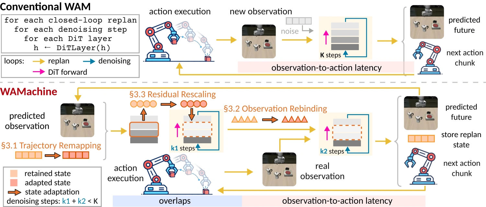

# WAMachine

**Training-Free Acceleration of World Action Models via Stateful Inference**

[Project page](https://parrotkk.github.io/WAMachine_page/) · [Paper](assets/paper/wamachine.pdf) · [Code](https://github.com/RSIScience/WAMachine)

## Overview

World Action Models repeatedly compute closely related states across replanning, iterative denoising, and Transformer execution. WAMachine is a training-free framework that preserves, adapts, and checks inference state so useful computation can continue as the control loop evolves.



## Method

WAMachine reuses state at three scopes:

1. **Trajectory Remapping** carries a denoised endpoint and direction into the next closed-loop replan.
2. **Observation Rebinding** computes a bounded anticipatory prefix during action execution, then checks and rebinds it to the real observation.
3. **Residual Rescaling** adapts retained layer residuals and refreshes them when probe checks fail.

## Results

Evaluated on Cosmos Policy, Fast-WAM-IDM, and Motus with LIBERO and RoboTwin 2.0:

| Metric | Result |
| --- | ---: |
| Observation-to-action speedup | **1.47–3.05×** |
| GPU inference speedup per replan | **2.23–3.27×** |
| Native task success retained | **96.69–99.54%** |

Speedups are measured against Native on matched 200-episode subsets. Task-success retention uses the large-sample evaluation reported in the paper.

## Resources

- [Full manuscript](assets/paper/wamachine.pdf)
- [Implementation](https://github.com/RSIScience/WAMachine)
- [Efficiency results](data/efficiency.csv)
- [Ablation results](data/ablation.csv)

## Citation

```bibtex
@misc{liu2026wamachine,
  title  = {{WAMachine}: Training-Free Acceleration of
            World Action Models via Stateful Inference},
  author = {Liu, Zhinan and Han, Haozhi and Zhang, Ruge and
            Ma, Teng and Ma, Tao and Liu, Zheng and
            Chen, Yifeng and Zhang, Yunquan and Cao, Ting and
            Liu, Yunxin and Li, Kun},
  year   = {2026},
  note   = {Manuscript}
}
```

## Contact

Correspondence: [likun@air.tsinghua.edu.cn](mailto:likun@air.tsinghua.edu.cn)
